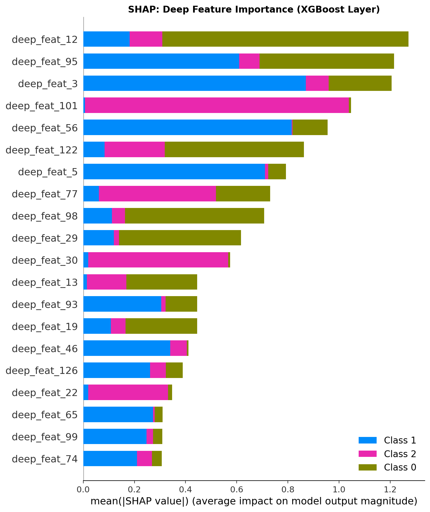
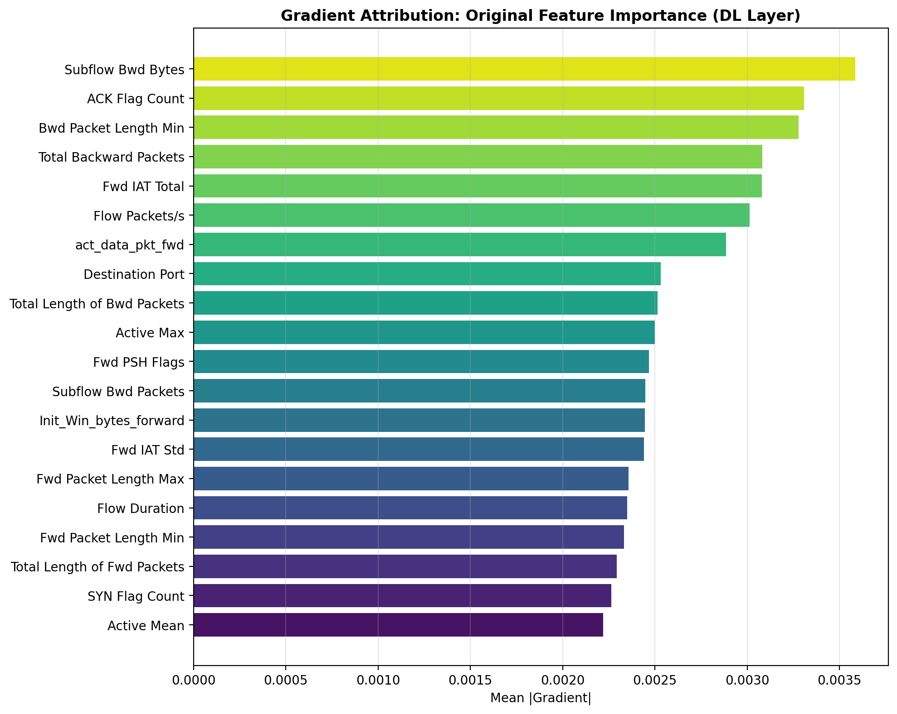

# 🛡️ Hybrid Network Intrusion Detection System with Explainable AI

<p align="center">
  
  
  
  
  
  
</p>

> **Final Year Capstone Project** — A production-ready, hybrid deep learning + machine learning pipeline for network intrusion detection, augmented with dual-layer explainability (SHAP + Gradient Attribution).

---

## 📌 Overview

This project implements a **Hybrid Network Intrusion Detection System (NIDS)** that combines the temporal representation power of deep learning with the classification strength of gradient-boosted trees, while remaining fully interpretable through Explainable AI (XAI) techniques.

### Key Contributions

| # | Contribution | Description |
|---|---|---|
| 1 | **Temporal Flow Windowing** | Groups W consecutive network flows into sequences, enabling the Bi-LSTM to learn real temporal attack patterns instead of treating each packet independently |
| 2 | **Focal Loss Training** | Addresses CIC-IDS-2017's heavy class imbalance (benign traffic >> attack traffic) by dynamically down-weighting easy examples |
| 3 | **Hybrid DL→XGBoost Architecture** | Uses a trained deep learning encoder as a feature extractor; XGBoost classifies the compressed 128-dim representations |
| 4 | **Dual-Layer Explainability** | SHAP TreeExplainer on XGBoost deep features + gradient attribution mapped back to original network packet features |

---

## 🏗️ Architecture

```
Raw Network Flows (CIC-IDS-2017)
         │
         ▼
┌─────────────────────────────────────────┐
│         Temporal Flow Windowing         │
│  W consecutive flows → (W, F) sequence  │
└─────────────────────────────────────────┘
         │
         ▼
┌─────────────────────────────────────────┐
│       DL Feature Extractor              │
│                                         │
│  Input(W, F)                            │
│    → Dense(64, ReLU) + Dropout(0.3)     │
│    → Bi-LSTM(64, return_sequences=True) │
│    → MultiHeadAttention(4 heads)        │
│    → [Residual + LayerNorm]             │
│    → GlobalAveragePooling1D             │
│    → 128-dim feature vector             │
│                                         │
│  Trained with Focal Loss (γ=2, α=0.25)  │
└─────────────────────────────────────────┘
         │
         ▼
┌─────────────────────────────────────────┐
│       XGBoost Classifier                │
│  n_estimators=300, max_depth=7          │
│  → Final traffic classification         │
└─────────────────────────────────────────┘
         │
         ▼
┌─────────────────────────────────────────┐
│       XAI Layer                         │
│  • SHAP TreeExplainer (XGBoost feats)   │
│  • Gradient Attribution (original feats)│
└─────────────────────────────────────────┘
```

---

## 📊 Results

### Final Model Performance (Hybrid DL → XGBoost)

| Metric | Score |
|---|---|
| **Accuracy** | **97.33%** |
| **F1 (Macro)** | **0.9076** |
| **F1 (Weighted)** | **0.9728** |

### Per-Class Breakdown

| Class | Precision | Recall | F1-Score | Support |
|---|---|---|---|---|
| BENIGN | 0.98 | 0.98 | 0.98 | 2,814 |
| DDoS | 0.95 | 0.98 | 0.97 | 660 |
| DoS Hulk | 0.84 | 0.71 | 0.77 | 122 |

### Ablation Study — Why the Hybrid Approach Wins

| Method | Accuracy | F1 (Macro) | F1 (Weighted) |
|---|---|---|---|
| XGBoost (raw flattened windows) | 95.13% | 0.8012 | 0.9464 |
| DL Only (softmax head) | 97.22% | 0.8888 | 0.9708 |
| **Hybrid DL→XGBoost (Ours)** | **97.33%** | **0.9076** | **0.9728** |

The ablation confirms that each component contributes meaningfully — the DL encoder extracts richer representations than flat features alone, and XGBoost's ensemble structure pushes the final performance above the DL-only baseline.

---

## 📁 Project Structure

```
hybrid-intrusion-detection-xai/
│
├── hybrid_nids_pipeline.py     # Main pipeline (training, evaluation, XAI)
├── live_demo.ipynb             # Interactive inference notebook
├── requirements.txt            # Python dependencies
│
├── data/                       # Place CIC-IDS-2017 CSV files here (not tracked)
│   ├── Monday-WorkingHours.pcap_ISCX.csv
│   ├── Wednesday-workingHours.pcap_ISCX.csv
│   └── Friday-WorkingHours-Afternoon-DDos.pcap_ISCX.csv
│
├── models/                     # Saved model artifacts (generated, not tracked)
│   ├── feature_extractor.keras
│   ├── xgb_classifier.joblib
│   ├── label_encoder.joblib
│   ├── scaler.joblib
│   └── window_size.joblib
│
└── outputs/                    # Generated plots and reports
    ├── classification_report.txt
    ├── ablation_results.csv
    ├── confusion_matrix.png
    ├── roc_curves.png
    ├── training_history.png
    ├── ablation_study.png
    ├── class_distribution.png
    ├── shap_deep_features.png
    └── gradient_attribution.png
```

---

## 🚀 Getting Started

### Prerequisites

- Python 3.10+
- ~8 GB RAM recommended
- GPU optional (TensorFlow will use CPU automatically)

### 1. Clone the Repository

```bash
git clone https://github.com/Karan-g-2003/hybrid-intrusion-detection-xai.git
cd hybrid-intrusion-detection-xai
```

### 2. Install Dependencies

```bash
pip install -r requirements.txt
```

### 3. Download the Dataset

Download the **CIC-IDS-2017** dataset from:
> [https://www.unb.ca/cic/datasets/ids-2017.html](https://www.unb.ca/cic/datasets/ids-2017.html)

Place the following three CSV files in the `data/` folder:

```
data/Monday-WorkingHours.pcap_ISCX.csv
data/Wednesday-workingHours.pcap_ISCX.csv
data/Friday-WorkingHours-Afternoon-DDos.pcap_ISCX.csv
```

### 4. Run the Full Pipeline

```bash
python hybrid_nids_pipeline.py
```

This will:
1. Load and stratify-sample 60,000 rows per CSV file
2. Create temporal flow windows (W=10)
3. Train the DL feature extractor with Focal Loss
4. Run 3-way ablation study
5. Train and evaluate the hybrid XGBoost classifier
6. Generate SHAP + gradient attribution plots
7. Save all models to `models/` and plots to `outputs/`

### 5. Live Inference Demo

Open `live_demo.ipynb` in Jupyter to run single-sample inference on pre-trained models:

```bash
jupyter notebook live_demo.ipynb
```

---

## 🔍 Explainability

This project implements **dual-layer XAI** — a key research contribution:

### Layer 1: SHAP on XGBoost Deep Features
Explains which of the 128 **compressed deep features** influence the final classification, using SHAP's TreeExplainer for exact Shapley values.



### Layer 2: Gradient Attribution to Original Features
Traces importance back to the **original network packet features** (flow duration, packet length, port numbers, etc.) using TensorFlow GradientTape, giving human-interpretable explanations.



---

## 📈 Generated Visualizations

| Plot | Description |
|---|---|
| `training_history.png` | Loss and accuracy curves per epoch |
| `confusion_matrix.png` | Count + normalized confusion matrices |
| `roc_curves.png` | Per-class ROC curves with AUC scores |
| `ablation_study.png` | Bar chart comparing all 3 methods |
| `class_distribution.png` | Traffic class imbalance visualization |
| `shap_deep_features.png` | SHAP importance of 128 deep features |
| `gradient_attribution.png` | Top-20 original network feature attributions |

---

## 🧠 Technical Details

### Dataset: CIC-IDS-2017

The Canadian Institute for Cybersecurity Intrusion Detection dataset 2017 contains labeled network traffic captured over 5 days. This project uses:
- **Monday** — Benign traffic baseline
- **Wednesday** — DoS / Hulk attacks
- **Friday Afternoon** — DDoS attacks

Memory-safe stratified sampling (60,000 rows/file) is used to handle the full dataset size.

### Temporal Flow Windowing

Instead of classifying each flow in isolation, W=10 consecutive flows are grouped into a temporal window `(W, F)`. This enables:
- The **Bi-LSTM** to capture attack build-up patterns across time
- **Multi-Head Attention** to weight the most relevant timesteps in the window
- Window labels via **majority vote** across constituent flows

### Focal Loss

Focal Loss (Lin et al., ICCV 2017) is used during DL pre-training to handle the severe class imbalance (benign traffic >> attacks):

```
FL(p_t) = -α(1 - p_t)^γ · log(p_t)
```

With γ=2.0 and α=0.25, the loss down-weights easily classified benign samples and focuses learning on rare attack classes.

---

## 📦 Model Artifacts

After training, the following artifacts are saved in `models/`:

| File | Description |
|---|---|
| `feature_extractor.keras` | Trained Keras DL encoder (606 KB) |
| `xgb_classifier.joblib` | Trained XGBoost classifier (~2.1 MB) |
| `scaler.joblib` | StandardScaler fitted on training data |
| `label_encoder.joblib` | LabelEncoder for traffic class names |
| `window_size.joblib` | Window size hyperparameter for inference |

> **Note:** Model files are excluded from Git (`.gitignore`) due to size. Re-generate by running the pipeline.

---

## 📋 Configuration

All hyperparameters are centralized in the `Config` dataclass at the top of `hybrid_nids_pipeline.py`:

```python
@dataclass
class Config:
    sample_per_file: int = 60_000    # rows to sample per CSV
    window_size: int = 10            # flows per temporal window
    dense_units: int = 64            # DL dense layer size
    lstm_units: int = 64             # Bi-LSTM units per direction
    attn_heads: int = 4              # Multi-head attention heads
    focal_gamma: float = 2.0         # Focal loss concentration
    epochs: int = 15                 # Max training epochs
    xgb_n_estimators: int = 300      # XGBoost trees
    # ...and more
```

---

## 🎓 Academic Context

This project was developed as a **Final Year Capstone** for a B.Tech/B.E. degree. The pipeline demonstrates:

- **Novel architecture**: Combining temporal deep learning with gradient-boosted ensemble trees
- **Research-grade evaluation**: Ablation study, ROC curves, confusion matrix analysis
- **Explainability focus**: Dual XAI layer addresses the "black box" criticism of deep learning in security systems
- **Production readiness**: Modular code, config dataclass, serialized models, live inference function

---

## 📚 References

1. Lin, T. et al. — *Focal Loss for Dense Object Detection*, ICCV 2017
2. Lundberg, S. & Lee, S-I. — *A Unified Approach to Interpreting Model Predictions*, NeurIPS 2017 (SHAP)
3. Canadian Institute for Cybersecurity — *CIC-IDS-2017 Dataset*
4. Chen, T. & Guestrin, C. — *XGBoost: A Scalable Tree Boosting System*, KDD 2016

---

## 🪪 License

This project is released for academic and educational use.

---

<p align="center">Made with ❤️ for Final Year Capstone | CIC-IDS-2017 | TF + XGBoost + SHAP</p>
