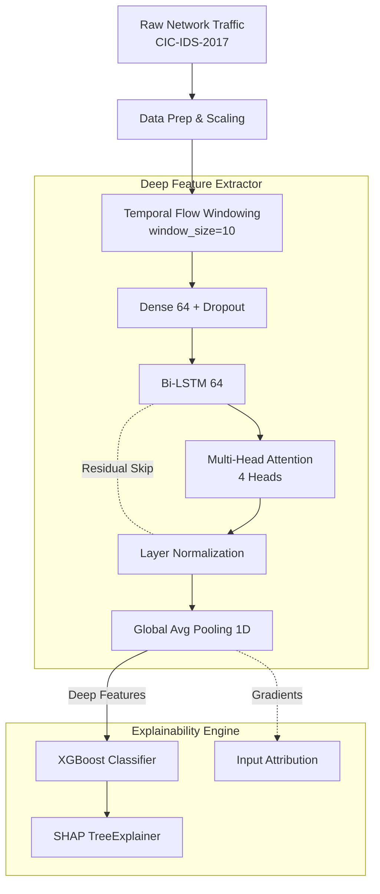

<div align="center">
  <h1>Hybrid Intrusion Detection System with Explainable AI (XAI)</h1>
  <p><strong>A Temporal Flow Windowing Approach to Network Anomaly Detection</strong></p>
  
  [](https://python.org)
  [](https://tensorflow.org)
  [](https://xgboost.readthedocs.io/)
  [](LICENSE)
</div>

---

## 📌 Overview

Modern networks face increasingly sophisticated cyber threats. Traditional anomaly-based Intrusion Detection Systems (IDS) rely heavily on deep learning, which often acts as a opaque "black box" and treats individual network packets or flows as isolated events.

This project implements a **novel Hybrid NIDS architecture** capable of accurately classifying complex cyberattacks while providing deep interpretability. Instead of analyzing independent flows, our model utilizes **Temporal Flow Windowing** to learn sequential attack signatures, and fuses deep feature extraction with an interpretable XGBoost decision layer.

Built for the **CIC-IDS-2017** benchmark dataset.

---

## 🚀 Key Research Contributions

1. **Temporal Flow Windowing**  
   Unlike standard approaches that treat each network flow independently (`timesteps=1`), our architecture groups consecutive traffic flows into temporal windows. This allows the Bi-LSTM layers to learn the *sequential* nature of cyberattacks (e.g., a port scan preceding a brute-force attempt).

2. **Focal Loss for Extreme Class Imbalance**  
   The CIC-IDS-2017 dataset is heavily dominated by `BENIGN` traffic (~80%). By replacing standard cross-entropy with Focal Loss, our deep learning pre-training down-weights easy majority samples, forcing the model to focus on subtle, rare attack vectors.

3. **Dual-Layer Explainability (XAI)**  
   - **Layer 1 (XGBoost Level):** SHAP analysis explains which high-level deep features drive the final classification.
   - **Layer 2 (Deep Feature Level):** Gradient attribution maps abstract deep feature importance back to the original network features (e.g., Flow Duration, Packet Length Mdn), providing actionable intelligence to Security Operations Centers (SOCs).

4. **Rigorous Ablation Methodology**  
   Proves the value of the hybrid architecture by directly comparing three models on the exact same temporal windows: XGBoost-only, DL-only, and Hybrid (Ours).

---

## 🧠 System Architecture

Our hybrid model forms a multi-stage pipeline:



---

## 📊 Evaluation Metrics

The pipeline evaluates the model beyond simple accuracy, generating a publication-quality artifacts suite in the `outputs/` folder:

- **Confusion Matrix:** Raw counts and row-normalized percentages.
- **ROC-AUC Curves:** One-vs-Rest AUC for all detected attack classes.
- **Ablation Study:** Macro/weighted F1 comparisons across architectural variants.
- **Interpretability Plots:** SHAP bar charts and gradient attribution horizontal bars.

---

## 🛠️ Installation & Usage

### 1. Requirements

Clone the repository and install the required dependencies:

```bash
git clone https://github.com/Karan-g-2003/hybrid-intrusion-detection-xai.git
cd hybrid-intrusion-detection-xai
pip install -r requirements.txt
```

### 2. Dataset Setup
Download the CIC-IDS-2017 CSV files and place them in the `data/` directory. By default, the pipeline expects:
- `Monday-WorkingHours.pcap_ISCX.csv`
- `Wednesday-workingHours.pcap_ISCX.csv`
- `Friday-WorkingHours-Afternoon-DDos.pcap_ISCX.csv`

### 3. Run Pipeline Complete
To execute the full data loading, windowing, DL training, XGBoost training, and XAI ablation suite:

```bash
python hybrid_nids_pipeline.py
```

*Note: The script implements memory-safe stratified sampling (default: 60,000 rows per day) to allow execution on consumer hardware. You can adjust `Config.sample_per_file` in the script to scale up.*

---

## 📂 Project Structure

```text
hybrid-intrusion-detection-xai/
├── data/                      # Place CIC-IDS-2017 CSVs here
├── models/                    # Saved artifacts (auto-generated)
│   ├── feature_extractor.keras
│   └── xgb_classifier.joblib
├── outputs/                   # XAI plots and evaluation metrics
│   ├── ablation_study.png     # Hybrid vs Base models
│   ├── roc_curves.png         # One-vs-Rest ROC
│   └── shap_deep_features.png # SHAP explainability
├── hybrid_nids_pipeline.py    # Main training & evaluation script
├── live_demo.ipynb            # Notebook demonstrating live inference
├── requirements.txt           # Python dependencies
└── README.md
```

---

## 📝 License & Attribution

This project is licensed under the MIT License - see the [LICENSE](LICENSE) file for details. 

**Dataset:** 
Canadian Institute for Cybersecurity, University of New Brunswick  
[CIC-IDS-2017 Dataset](https://www.unb.ca/cic/datasets/ids-2017.html)
